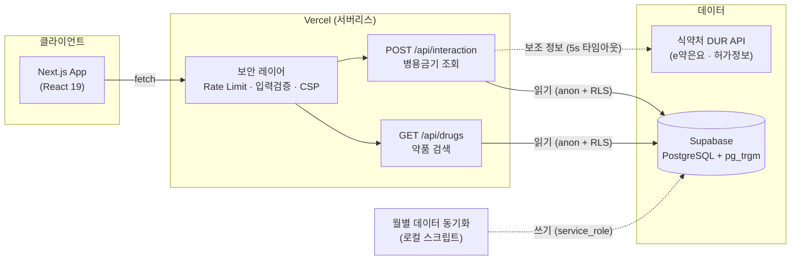
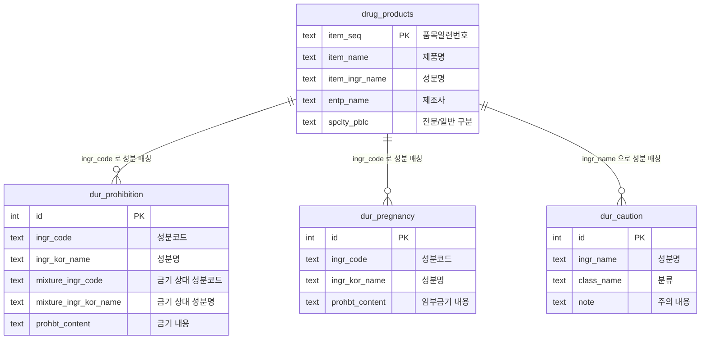

# 약방 (YackBang) 💊

> **복용 중인 약이 함께 먹어도 되는지, 전문 용어 없이 쉽게 확인하세요.**

식약처 DUR(의약품 사용 재검토) 데이터를 기반으로 의약품 병용금기 정보를 일반인도 이해할 수 있는 언어로 제공하는 서비스입니다.

<div align="center">

### 🔗 [https://yack-bang.vercel.app](https://yack-bang.vercel.app)

</div>

[](https://nextjs.org)
[](https://typescriptlang.org)
[](https://supabase.com)
[](https://tailwindcss.com)
[](https://yack-bang.vercel.app)

---

## 만들게 된 계기

감기로 고생하던 어느 날, 타이레놀이 잘 듣지 않는 듯하여 다른 감기약을 함께 복용하려 했습니다.
그러다 우연히 약 뒷면의 병용금기 안내를 발견했습니다.

약을 함께 먹어도 되는지조차 일반인이 알기 어렵다는 사실을 그때 깨달았고,
누구나 쉽게 확인할 수 있는 서비스가 필요하다고 생각해 만들게 되었습니다.

---

## 주요 기능

### 🔍 의약품 검색 & 병용금기 조회
- 약품명 자동완성 검색 (Supabase `pg_trgm` 인덱스, 50~150ms 응답)
- **단일 약 조회**: 병용금기 성분 목록, 임부금기, 노인 주의, 용량/기간 주의, 서방정 분할 금지
- **병용 비교 (2~5개)**: 병용금기 쌍, 효능군 중복, 성분 중복, 허가정보 기반 상호작용 경고

### 🔗 URL 공유 & 최근 기록
- 조회 결과를 URL로 공유 — 링크 하나로 동일한 조합 자동 조회
- 최근 조회 기록 5건 자동 저장 (localStorage), 클릭 한 번으로 재조회

### ⚠️ 실생활 위험 조합 가이드
- 한국 약국 판매량 상위 약품 기준 8가지 위험 조합 (타이레놀+음주, 감기약+수면유도제 등)
- 최근 인기 GLP-1 계열 다이어트 주사 (위고비·마운자로) 관련 4가지 주의 조합
- 계열명 매칭 지원 — "티아지드계"처럼 계열명으로 등록된 금기도 개별 성분명("히드로클로로티아지드")으로 탐지
- safe 결과에 DUR 한계 고지 — 미등재 임상 상호작용 존재 가능성 안내

### 📱 모바일 최적화 & PWA
- 모바일 하단 탭 내비게이션 (검색 ↔ 결과 탭 전환)
- 조회 시작 시 결과 탭 자동 전환 + 스켈레톤 로딩 UI
- PWA 지원 — 홈 화면에 추가, 앱처럼 실행 (standalone 모드)

---

## 기술 스택

| 구분 | 기술 |
|---|---|
| **프레임워크** | Next.js 16 (App Router) + React 19 + TypeScript |
| **스타일** | Tailwind CSS v4 + CSS Modules |
| **데이터베이스** | Supabase (PostgreSQL + pg_trgm 인덱스) |
| **외부 API** | 식약처 공공데이터 DUR API, e약은요 API |
| **배포** | Vercel |
| **폰트** | Noto Sans KR (Google Fonts) |

---

## 시스템 아키텍처



- **프로덕션 앱**은 `anon` key + RLS로 **읽기 전용** 접근만 수행
- **데이터 적재/갱신**은 로컬에서 `service_role` key로만 실행 (Vercel에 키 노출 없음)
- 외부 식약처 API는 e약은요·허가정보 등 **보조 정보**에만 사용 (실패해도 핵심 결과에 영향 없음)

---

## 데이터베이스

식약처 공공데이터(허가정보·DUR)를 수집·정제해 Supabase에 적재합니다.
모든 테이블에 **RLS(Row Level Security) + SELECT 전용 정책**을 적용해 프로덕션 앱은 읽기만 가능합니다.

### ERD (논리 모델)



> `dur_caution`은 노인·연령·용량·기간·서방정분할 등 **5개 주의 테이블의 공통 구조**를 요약 표기한 것입니다.

### 테이블 목록

| 테이블 | 내용 |
|---|---|
| `drug_products` | 의약품 기본 정보 (품목명, 성분, 제조사, 이미지 URL) |
| `dur_prohibition` | 병용금기 성분 쌍 |
| `dur_pregnancy` | 임부금기 |
| `dur_elderly_caution` | 노인 주의 |
| `dur_age_restriction` | 특정 연령대 금기 |
| `dur_dosage_caution` | 용량 주의 |
| `dur_duration_caution` | 투여기간 주의 |
| `dur_tablet_split_caution` | 서방정 분할 금지 |
| `dur_efficacy_duplication` | 효능군 중복 |

---

## API 명세

### `GET /api/drugs` — 약품 검색

| 항목 | 값 |
|---|---|
| Query | `q` (검색어, 2~100자) |
| Rate Limit | IP당 60회/분, 전체 300회/분 |
| 응답 캐시 | `s-maxage=3600` |

```jsonc
// GET /api/drugs?q=타이레놀
// 200 OK
[
  {
    "itemSeq": "196000050",
    "itemName": "타이레놀정500밀리그람",
    "entpName": "한국얀센",
    "itemIngrName": "Acetaminophen",
    "spcltPblc": "일반의약품",
    "pillImageUrl": "https://..."
  }
]
```

### `POST /api/interaction` — 병용금기 조회

| 항목 | 값 |
|---|---|
| Body | `{ mode: "single" \| "multi", drugs: SelectedDrug[] }` |
| 제약 | `drugs` 1~5개, 필드 길이 제한 |
| Rate Limit | IP당 5회/분, 전체 50회/분 |
| maxDuration | 10초 |

```jsonc
// POST /api/interaction
// Request
{
  "mode": "multi",
  "drugs": [
    { "itemSeq": "196000050", "itemName": "타이레놀정500밀리그람", "itemIngrName": "Acetaminophen" },
    { "itemSeq": "...",       "itemName": "판콜에스내복액",       "itemIngrName": "..." }
  ]
}

// Response (multi)
{
  "drugs": [ /* 입력 약 목록 */ ],
  "dangerPairs": [ /* 병용금기 쌍 */ ],
  "efficacyDuplicates": [ /* 효능군 중복 */ ],
  "ingredientOverlaps": [ /* 성분 중복 */ ],
  "labelWarnings": [ /* 허가정보 기반 경고 */ ],
  "isSafe": false
}
```

> `mode: "single"` 은 단일 약의 병용금기·임부금기·노인주의 등을 반환합니다.

---

## 기술적 도전과 해결

식약처 공공데이터 API를 활용하려 했지만, 공식 문서만으로는 실제 동작을 신뢰하기 어려웠습니다.
그래서 응답값을 직접 호출하며 하나씩 검증했고, 그 과정에서 문서와 다른 동작들을 발견했습니다.

### 1. 텍스트 파라미터 필터링이 동작하지 않음

약품명·성분명 같은 텍스트 파라미터로는 필터링이 동작하지 않아, **어떤 값을 넣어도 전체 데이터가 그대로 반환**됐습니다.

→ API에서 필터링하는 대신, **전체 데이터를 DB에 적재해 직접 조회**하는 방식으로 전환했습니다.

### 2. 두 서비스의 ITEM_SEQ 체계 불일치

허가정보와 DUR 두 서비스의 `ITEM_SEQ`(품목일련번호) 체계가 서로 달라, 같은 키로 매칭하면 실패했습니다.

→ 약품 매칭을 **성분 코드(`INGR_CODE`) 기준**으로 처리해, 품목번호 체계 차이와 무관하게 정확히 연결되도록 했습니다.

### 3. 저장소 선택 — DuckDB vs Supabase

처음엔 인메모리 분석에 강한 DuckDB를 검토했지만, 데이터 파일을 그대로 서버에 올리기에는 용량 부담이 컸습니다.

→ **Supabase(PostgreSQL)로 일원화**하고, 검색은 `pg_trgm` 인덱스로 최적화했습니다.

### 4. 계열명으로 등록된 병용금기 누락

DUR 데이터에는 `mixture_ingr_kor_name`이 "티아지드계"처럼 **계열명**으로 저장된 경우가 있어, 개별 성분명("히드로클로로티아지드")과 정확히 일치하지 않아 매칭이 누락됐습니다.

→ 계열명에서 접미사(계/계열/약물 등)를 제거한 **stem을 추출해 성분명 포함 여부를 확인**하는 폴백 로직을 추가했습니다.

---

## 성능 최적화

### 문제

`drug_products` 테이블은 약 **43,000건** 규모입니다. 인덱스 없이 `ILIKE '%검색어%'`로 부분 일치 검색을 하면
**선행 와일드카드(`%...`)** 때문에 일반 B-tree 인덱스를 타지 못하고 `Seq Scan`(전수 스캔)이 발생합니다.
데이터가 늘수록 응답 시간이 선형으로 악화되는 구조입니다.

### 해결

PostgreSQL의 **`pg_trgm` (trigram) 확장**을 활성화하고 `item_name`에 GIN 인덱스를 적용했습니다.
trigram 인덱스는 문자열을 3글자 단위로 분해해 색인하므로, 선행 와일드카드 검색에서도 인덱스를 활용할 수 있습니다.

```sql
CREATE EXTENSION IF NOT EXISTS pg_trgm;
CREATE INDEX idx_drug_products_name_trgm
  ON drug_products USING gin (item_name gin_trgm_ops);
```

### 측정 결과

`EXPLAIN (ANALYZE, BUFFERS)`로 인덱스 적용 전후를 비교했습니다.
(검색어 `'타이레놀'` — 43,236건 중 7건 매칭, 각 3회 실행 후 안정값 기준)

| 구분 | 실행 계획 | 쿼리 실행 시간 |
|---|---|---|
| **인덱스 미적용** | `Seq Scan` — 43,236건 전수 검사 후 43,229건 필터링 | 약 **87ms** (콜드 스타트 시 1,000ms 이상) |
| **pg_trgm 적용** | `Bitmap Index Scan` — 인덱스 탐색 | 약 **0.9ms** |

> 동일 쿼리 기준 **약 95배** 개선. `Seq Scan`이 `Bitmap Index Scan`으로 전환되며 전수 검사가 사라졌습니다.

순수 DB 쿼리는 1ms 미만이며, 사용자 체감 응답(네트워크·서버리스 왕복 포함)은 50~150ms 수준입니다.
여기에 응답 `s-maxage=3600` 캐시 헤더를 더해, 반복 검색은 Vercel 엣지 캐시에서 즉시 응답합니다.

---

## 보안 아키텍처

```
요청 진입
  ↓
글로벌 회로 차단기 (분당 전체 50회 초과 → 503)
  ↓
IP별 Rate Limiting (분당 5회 초과 → 429)
  ↓
입력 검증 (배열 크기 1~5, 필드 길이 제한)
  ↓
Supabase SDK 파라미터 쿼리 (SQL 인젝션 방지)
  ↓
외부 API fetch 타임아웃 5초 + maxDuration 10초
```

- **XSS**: React 자동 이스케이프 + Content Security Policy 헤더
- **클릭재킹**: `X-Frame-Options: DENY`
- **MIME 스니핑**: `X-Content-Type-Options: nosniff`
- **레퍼러 노출**: `Referrer-Policy: strict-origin-when-cross-origin`
- **DB 접근**: Supabase anon key + RLS(SELECT only) — 프로덕션은 읽기 전용

---

## 환경변수

모든 키는 **서버 전용**입니다. `NEXT_PUBLIC_` 접두사를 붙이지 마세요.

```bash
# Vercel 환경변수 (Settings → Environment Variables)
SUPABASE_URL=https://your-project-id.supabase.co
SUPABASE_ANON_KEY=eyJhbGciOiJIUzI1NiIsInR5cCI6IkpXVCJ9...  # anon (public) key
DUR_API_KEY=your_dur_api_key

# 로컬 전용 (.env.local에만, 데이터 동기화 스크립트용)
SUPABASE_SERVICE_ROLE_KEY=eyJhbGciOiJIUzI1NiIsInR5cCI6IkpXVCJ9...
```

> **보안 구조**: 프로덕션은 `SUPABASE_ANON_KEY` + RLS(SELECT only) 조합으로 읽기 전용.
> `SUPABASE_SERVICE_ROLE_KEY`는 로컬에서 월별 데이터 동기화 시에만 사용하며 Vercel에 올리지 않습니다.

---

## 로컬 실행

```bash
# 1. 저장소 클론
git clone https://github.com/cjfwls39/YackBang.git
cd YackBang

# 2. 의존성 설치
npm install

# 3. 환경변수 설정
cp .env.example .env.local
# .env.local 파일에 실제 키 값 입력

# 4. 개발 서버 실행
npm run dev
# → http://localhost:3000

# 프로덕션 빌드 확인
npm run build && npm start
```

---

## 추후 개발 예정

- [ ] **약봉투 스캔 (OCR)** — 약봉투 사진을 업로드하면 AI가 약품명을 자동 인식해 병용 체크까지 한 번에 처리 (Claude Vision API 활용 예정)
- [ ] **나의 약 보관함** — 만성질환자를 위한 상시 복용 약 저장 기능. 새 약 추가 시 "보관함과 비교" 버튼으로 즉시 병용 체크
- [ ] **Upstash Redis 분산 Rate Limiting** — 현재 인메모리 방식을 Redis 기반으로 교체해 Vercel 멀티 인스턴스 환경에서도 정확한 트래픽 제어

---

## 면책 고지

이 서비스는 **참고용 정보만 제공**합니다.
실제 복약 여부는 반드시 의사 또는 약사와 상담하시기 바랍니다.
식약처 데이터 기준이며, 최신 정보와 다를 수 있습니다.
